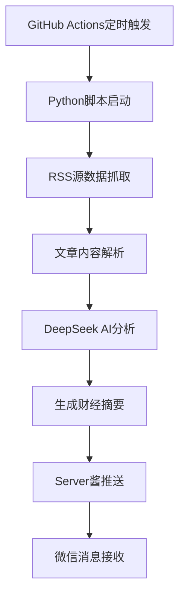

# 📈 FinNewsCollectionBot · 智能财经资讯助手

[](https://github.com/sgrsun3/FinNewsCollectionBot/actions/workflows/rss-bot.yml)


> 🤖 基于 DeepSeek AI 的智能财经新闻聚合与摘要系统，专为投资决策者打造

## ✨ 项目特色

- 🕘 **智能定时推送** - 每日上午9点、下午5点自动生成财经摘要
- 🌍 **全球资讯聚合 - 覆盖华尔街见闻、36氪、BBC、FT等主流财经媒体
- 🧠 **AI深度分析** - 使用DeepSeek大模型进行专业财经分析
- 📱 **微信即时推送** - 通过Server酱服务直达微信
- ⚡ **零配置部署** - GitHub Actions自动运行，无需服务器

## 🚀 快速开始

### 1. Fork 项目
点击右上角的 Fork 按钮，将项目复制到你的GitHub账户

### 2. 配置API密钥
在项目设置中添加以下Secrets：

| Secret名称 | 说明 | 获取方式 |
|-----------|------|---------|
| `OPENAI_API_KEY` | DeepSeek API密钥 | [DeepSeek官网](https://platform.deepseek.com/) |
| `SERVER_CHAN_KEYS` | Server酱推送密钥 | [Server酱官网](https://sct.ftqq.com/) |

### 3. 启用GitHub Actions
- 进入项目的 Actions 页面
- 点击 "I understand my workflows, go ahead and enable them"
- 工作流将自动开始运行

### 4. 验证运行
- 查看 Actions 页面的运行状态
- 成功运行后，你将收到微信推送的财经摘要

## 📊 数据源覆盖

### 🇨🇳 中国经济
- 华尔街见闻 - 专业财经资讯
- 36氪 - 科技与创投
- 东方财富 - 股市资讯
- 中新网 - 官方财经新闻
- 国家统计局 - 权威数据发布

### 🇺🇸 美国经济  
- ZeroHedge - 华尔街深度分析
- ETF Trends - 投资趋势分析
- Federal Reserve - 美联储官方声明

### 🌍 全球经济
- BBC Business - 全球财经新闻
- FT中文网 - 金融时报中文版
- Wall Street Journal - 华尔街日报
- Investing.com - 全球投资资讯
- Thomson Reuters - 路透财经新闻

## 🛠️ 技术架构



### 核心技术栈
- **Python 3.9+** - 主要开发语言
- **feedparser** - RSS源解析
- **newspaper3k** - 文章内容提取
- **DeepSeek API** - AI智能分析
- **GitHub Actions** - 自动化部署
- **Server酱** - 微信推送服务

## 📈 使用场景

### 🏢 机构投资者
- 券商研究所自动生成投资快报
- 基金公司日常市场监测
- 投资银行行业分析支持

### 👤 个人投资者
- 快速了解市场热点和趋势
- 获取专业投资分析观点
- 跟踪宏观经济政策变化

### 📰 财经媒体
- 内容创作灵感来源
- 热点话题追踪
- 专业分析参考

## ⚙️ 自定义配置

### 修改推送时间
编辑 `.github/workflows/rss-bot.yml` 文件中的cron表达式：

```yaml
schedule:
  - cron: '0 1 * * *'  # 北京时间 09:00
  - cron: '0 9 * * *'  # 北京时间 17:00
```

### 添加RSS数据源
在 `financebot.py` 文件的 `rss_feeds` 字典中添加新的数据源：

```python
rss_feeds = {
    "新分类": {
        "数据源名称": "RSS链接地址",
    }
}
```

### 调整AI分析提示词
修改 `summarize()` 函数中的system prompt来改变分析风格。

## 🔧 故障排除

### 常见问题

**Q: GitHub Actions没有运行？**
A: 检查是否已启用Actions，并确认Secrets已正确设置。

**Q: 没有收到微信推送？**
A: 验证SERVER_CHAN_KEYS是否正确，检查Server酱服务状态。

**Q: AI分析质量不佳？**
A: 可以调整RSS源选择，或修改AI提示词模板。

### 日志查看
在GitHub Actions页面查看详细运行日志，定位具体问题。

## 🤝 贡献指南

欢迎提交Issue和Pull Request来改进项目：

1. **报告问题** - 在Issues中描述遇到的问题
2. **功能建议** - 提出新的功能想法
3. **代码贡献** - Fork项目并提交PR
4. **文档改进** - 帮助完善文档和说明

## 📄 许可证

本项目采用 MIT 许可证 - 查看 [LICENSE](LICENSE) 文件了解详情。

## 🙏 致谢

感谢所有贡献者和开源社区的支持！

---

**⭐ 如果这个项目对你有帮助，请给个Star支持一下！**
